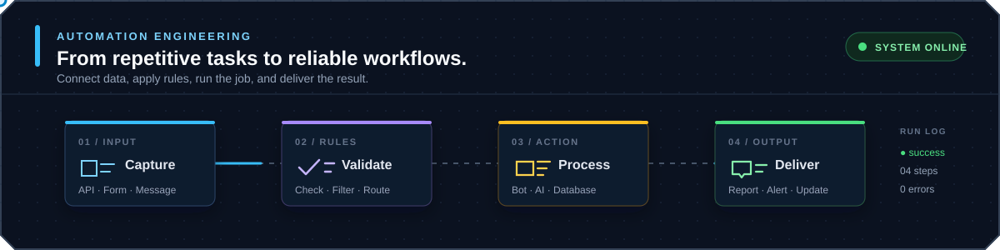
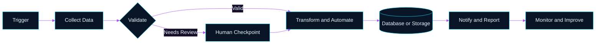

<picture>
  <source media="(prefers-reduced-motion: reduce)" srcset="./assets/automation-core-static.svg" />
  
</picture>

  
  
  

**I turn repetitive business workflows into reliable automation, bots, and AI-assisted systems.**

`Data Ingestion` · `API Integration` · `Workflow Automation` · `AI Agents` · `Dashboards` · `Notifications`

## About Me

I am a solo software builder focused on automation engineering and bot development. I work end to end: understanding a manual process, designing the workflow, connecting data sources, implementing the system, and making the result observable through logs, notifications, reports, or dashboards.

- ⚙️ **Workflow Automation**: scheduled jobs, validation, deduplication, state machines, and human approval steps
- 🤖 **Bots and AI**: Telegram bots, AI-assisted document processing, RAG, vision, and structured extraction
- 🔌 **System Integration**: Google Workspace, REST APIs, Supabase, databases, storage, and messaging channels
- 🖥️ **Full-Stack Delivery**: web dashboards, mobile apps, backend services, desktop utilities, and deployment workflows
- 🛡️ **Operational Thinking**: retries, audit trails, role-based access, dry runs, recovery paths, and secure configuration

> [!NOTE]
> I am currently targeting **Automation Engineer / Bot Developer** opportunities where I can convert real business operations into maintainable software systems.

## Automation Workflow

## Selected Automation Work

Private systems are shown as sanitized summaries. Public projects link directly to source code.

<table>
<tr>
<td width="50%" valign="top">

### [Classroom Automation Pipeline](https://github.com/BossZY27/webscraping-classroom-ai)

Synchronizes Google Classroom and Drive resources, removes duplicate files with content hashing, stores metadata, schedules recurring updates, generates AI summaries, and exports organized learning packages.

`Python` `FastAPI` `Google APIs` `SQLite` `APScheduler` `Gemini/OpenAI/Ollama`

Public repository · sanitized source snapshot

</td>
<td width="50%" valign="top">

### E-Receipt Reconciliation Bot

Reads structured information from incoming emails, compares receipt values, records Match/Unmatch results in Google Sheets, and sends automated LINE or email alerts on a schedule.

`Google Apps Script` `Gmail` `Google Sheets` `Triggers` `Notifications`

Private project · sanitized technical summary

</td>
</tr>
<tr>
<td width="50%" valign="top">

### [TikTok Analytics Workflow](https://github.com/BossZY27/tiktok-analytics)

Combines multi-account metrics, role-based access, data imports, synchronization workers, revenue workflows, and AI-assisted insights in one dashboard.

`Next.js` `TypeScript` `Prisma` `PostgreSQL` `Data Pipelines`

Public repository · MVP under active development

</td>
<td width="50%" valign="top">

### [AI Scheduling Assistant](https://github.com/BossZY27/secretary-bot)

Accepts text or schedule images, extracts structured appointments with AI vision, checks free time, stores events, and delivers morning summaries and appointment reminders through Telegram.

`Python` `Telegram Bot` `Gemini` `SQLite` `Scheduled Jobs`

Public repository · solo project

</td>
</tr>
</table>

  <a href="https://github.com/BossZY27/loongmordek-auto-sheets">Loongmordek Auto Sheets</a> ·
  <a href="https://github.com/BossZY27/thai-rag-api">Thai RAG API</a> ·
  <a href="https://github.com/BossZY27/forex-order-watcher">Forex Order Watcher</a>

<b>More Systems I Have Built</b>

 

- **Content Operations Automation**: AI content parsing, Google Sheets approval states, and Make-ready publishing queues
- **TeleSales Workflow Platform**: lead operations, reminders, reporting, spreadsheet imports, and Google Sheets synchronization
- **Backup and Recovery Automation**: MinIO/rclone scheduling, retention, locking, health checks, dry runs, and restore workflows
- **Low-Latency Desktop Tooling**: MPD stream monitoring, segment prediction, packaged Windows releases, and runtime diagnostics
- **Secure AI Workspace Bridge**: local-first MCP access with path controls, rate limits, approvals, and sandboxed job execution
- **Full-Stack Business Platforms**: loyalty, franchise operations, construction milestones, analytics, and group-ordering systems

## Technology Stack

### Languages

### Automation, Backend, and AI

## Currently Designing

**Sales Lead Detection and Follow-Up Automation**, a proposed system for identifying relevant sales opportunities from Facebook posts using configurable products, keywords, locations, and quantities. The design includes A-D lead grading, screenshot capture and history, sales-team handoff, follow-up status, and daily reporting.

> [!IMPORTANT]
> This is currently presented as a **proposed system design**, not a completed production system. The ingestion method remains an implementation decision and is not assumed to use the Facebook API.

## Let's Build Something Useful

I am interested in automation projects where software can reduce repetitive work, connect disconnected tools, improve response time, and make operational data easier to act on.

Designed around automation, reliability, and honest engineering evidence.

